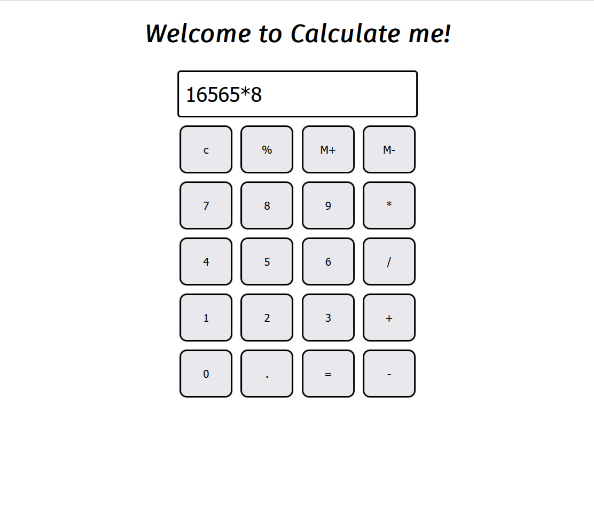

# 🧮 Calculator Web App - Calculate Me!

Welcome to **Calculate Me!** – a responsive and user-friendly calculator built using **HTML**, **CSS**, and **JavaScript**.

This web app performs basic arithmetic operations and features a clean, intuitive interface.

---

## 📸 Preview



---

## 🚀 Features

- ✅ Responsive UI using Flexbox
- ✅ Real-time calculation on button press
- ✅ Supports:
  - Addition, Subtraction, Multiplication, Division
  - Percentage calculation
  - Memory (M+/M-) placeholders
  - Clear (`C`) function
- ✅ Minimalist design with custom utility classes
- ✅ Built with clean and readable code

---

## 🛠️ Tech Stack

- HTML5
- CSS3
- JavaScript (ES6)

---

## 📂 Project Structure

```bash
Calculator-Project/
├── index.html
├── style.css
├── utils.css
├── script.js
├── demo.png
└── README.md
